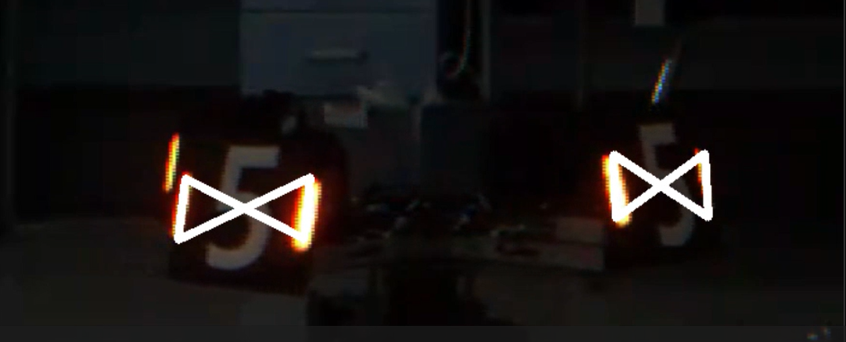
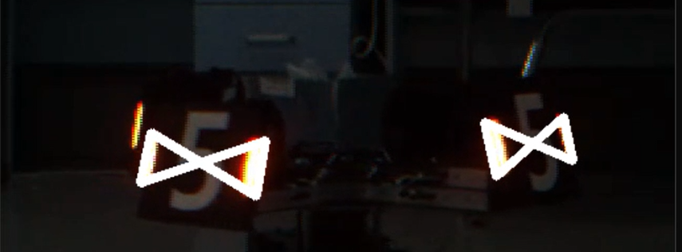
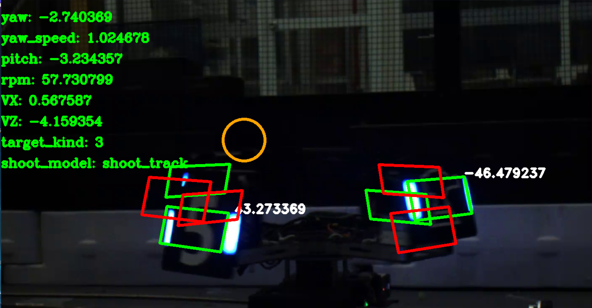

# 2025赛季浙江师范大学浙狮战队自瞄算法开源

## 前言
Z_LION_AutoAim2025对本人24赛季的自瞄算法进行重构,增强代码的可读性和综合性能.
由于本人所处战队本赛季不参与超级对抗赛,所以本框架以3V3与1V1为导向,不包含大小符、基地装甲板以及前哨装甲板。

如果本项目能对您有所帮助,麻烦给本项目一个Star,非常感谢!

## 项目特点
1. 跨平台,在windows中能够进行视频样本调试,而在Linux实际运行
2. 火控层由算法组编写,多策略融合

## 四条流水线
1. serial_read:获取嵌入数据
2. detect:二维图像识别,发布二维装甲板数据
3. process:解算层进行整车观测,火控层计算出控制数据并发布
4. serial_send:传输控制数据

## 调试方式
1. 可以在windows进行仿真测试,采用Visual Studio进行调试
2. 真实测试采用单独的debug节点imshow进行调试


## 环境配置

* Ubuntu22.04

* ROS2

懒人方法,按照提示流程走,会自动配置cmake,gcc/g++,ros2:

```
wget http://fishros.com/install -O fishros && . fishros
```

* OpenVINO-2023.2.0

[参考安装教程]: https://blog.csdn.net/2301_79591615/article/details/142714612?fromshare=blogdetail&amp;sharetype=blogdetail&amp;sharerId=142714612&amp;sharerefer=PC&amp;sharesource=pytorch_learn&amp;sharefrom=from_link

* OpenCV-4.6.0

[编译安装]: https://github.com/opencv/opencv.git

* Eigen

```
sudo apt-get install libeigen3-dev
```

* Ceres-Solver

[编译安装]: https://github.com/ceres-solver/ceres-solver


## 各个模块

### 文件架构

- Detector: 识别层
	- TransDetector: 用于转换为detect节点发布数据
		- Armor: 装甲板定义
		- Light: 灯条定义
		- Video: 多视频播放器,用于视频样本调试
		- Machine: 图像处理类
		- LightFinder: 灯条识别类
		- ArmorFinder: 装甲板识别类
		- YoloModel: 神经网络推理类
		- NumberFinder: 数字识别类
- Processor: 解算层
	- TransProcessor
		- ArmorPos: 定义解算中的装甲板
		- ArmorSolver: 装甲板解算类
			- FaceAngleSolver: 朝向角解算类
		- CarSolver: 观测类
			- CarState: 整车观测类
			- DataObserver: 数据观测类,优化半径与高度差精度
			- Ekf: 卡尔曼滤波器观测类
			- TranslationState: 平移观测类
		- Coordinate: 坐标系转换类
		- TargetPlanner: 击打目标规划器
	
- Controler: 火控层
	- TransControler: 用于转换为process节点发布数据
		- PitchCompensator: 抬头补偿类
		- RangeSetter: 范围规划类
		- ShootStrategy: 击打策略类
			- StrategyPlanner: 击打策略规划器
		- TimePredictor: 延迟预测类
- tools: 工具类
	- Tools.h: 放置一些常用函数
	- ImageShower.h: 用于独立线程的展示类
	- Color.h: 颜色类
- simple: windows测试运行文件
	- debug.h: 定义当前执行文件
	- process_test.cpp 对应process节点的解算火控实现
	- detect_test.cpp 对应detect节点的识别实现

### Detector 识别层
1. 我们认为传统视觉尽管在鲁棒性上不及神经网络,但是传统视觉的精度要高于神经网络并且神经网络训练不足可能导致一些奇怪的误识别,所以配备传统视觉能够解决一些应急情况

2. 融合算法: 先基于letterbox获取精度较低的装甲板四点,对左右侧两点分别取roi,灯条即在roi中心,以提高精度





3. 串口数据需要在识别层接收,因为获取相机帧的瞬间,我们希望此时车的姿态尽可能与其header同步

### Processor 解算层

1. 整车观测通过迭代高低装甲板来保证锁定当前装甲板实现卡尔曼滤波器观测,采用反向延申计算长短轴半径和高度差

2. 对于长短轴半径更新误差,我们发现其精度很差,默认长短轴半径相等可以应对多数环境,维护某个设定长度的队列,每次计算出新的长短轴与高度差则入队,满队则出队,每次取整个队列的算术平均

3. 对于完全平移的目标,直接使用识别到的装甲板进行运动观测具有更好的适应性,在应对低转速的(平移)目标时,能够更快的锁定

4. 整车观测滤波器采用拓展卡尔曼,测量装甲板的xyz转为pitch,yaw,distance,观测整车在世界坐标系下的运动状态x,y,z,yaw,vx,vy,vz,vyaw,使用ceres实现.

5. 朝向角优化: 较远处解算出的角度可能会取反,当画面中出现两个同类型装甲板时,左侧只可能为正而右侧为负来优化一些情况下的朝向角。我们测试发现三点法映射迭代计算出的朝向角精度要高于PnP

   

   

### Controler 火控层

1. 我们近似的认为: 预测时间 = 飞行时间 + 串口通讯延迟 + 发弹延迟 + 程序延迟,其中飞行时间需要通过抬头补偿计算,串口通讯延迟默认是静态值,程序延迟则是从相机时间戳到当前,所以我们尽可能避免在计算预测时间之后有不稳定的耗时波动,发弹延迟包含了嵌入控制延迟和子弹从被挤入摩擦轮瞬间到被加速到射出瞬间的时间,这段时间可能存在波动,我们认为需要机械进行优化。总而言之,高延迟对预测时间的计算误差没那么大,但是较大的时间波动区间会大大影响敌方高转速下的命中率。

2. 使用迭代法计算预测时间:我们需要击打的目标理论上并不是当前目标,而是未来,我们发现迭代到第三次基本收敛。而这段程序的耗时非常小,带来的额外时间开销可以忽略不记

3. 我们认为仅仅命中率对于我们的应用环境中衡量自瞄效果并不优秀,不同的火控策略会带来不同的击打效果,我们改为用命中率与实际DPS与理论最高DPS比*来综合衡量自瞄效果.

4. 我们针对不同转速的车实行不同模式的算法,目的是保证基础的命中率上,尽可能实现更高的击打效果:

   1. 平移击打策略:对于(极低转速RPM < 10)平移的目标,我们需要保证在判断瞄准的情况下以最高射频击打.

   2. 跟随击打策略:(根据云台的转动性能,如10 < RPM < 60)我们会设置一定的跟随角A,敌方装甲板在+-A区间内将尽可能让云台跟上敌方转来的装甲板,否则预瞄下一个转来的装甲板.由于目前我们难以将角度参数与电机参数直接量化,所以采用暴力测试的方法,手动测试不同转速下的跟随性能,调整跟随角,建立相关函数。只要能进行跟随击打,我们尽可能选择跟随击打策略,在非预瞄下一直开火,理论dps更高,实测效果较好。我们测试发现,只要跟随增幅参数设置正确,总是存在一个跟随角,使得自瞄跟随击打效果良好

      

   3. 瞄准中心策略:瞄准中心能够让装甲板的受击面积最大,也就是允许误差最大,同时减小枪口晃动将提升解算的精度.在此基础上,调整最小击打的判断x

   4. 精准击打策略:瞄准方式与瞄准中心相同,但是保证每个装甲板打且仅打一颗,并且根据下一帧敌方装甲板可能出现的位置创建延迟传输的线程,是我们理论上的最高精度.适合90转以及以上的目标,缺点是不能击打移动击打目标,移动对其命中率影响较大

5. 实际上仅仅使用预测值并不能命中目标,还需要一个补偿让枪口能够跟上装甲板,而云台对目标的瞄准可以简单抽象为偏航角和俯仰角,而我们这里讨论偏航角yaw,由于有敌方目标状态,我们可以借此计算出对应的期望yaw_speed，那么只需要让yaw_speed乘以一个系数与yaw相加就可以得到增强后的跟随角,这个系数似乎是一个常数,且我们针对移动分量和旋转分量分别计算独立的系数为yaw增幅,分别用于瞄准平移目标与旋转目标。

## 编译方法

```
colcon build --packages-select auto_aim_interfaces
source install/setup.bash
colcon build
```

## 特别鸣谢

1. 感谢上海交通大学交龙战队2021赛季开源与23赛季青工会分享

   https://github.com/Harry-hhj/CVRM2021-sjtu

2. 感谢华南师范大学PIONEER战队2024年自瞄开源分享

   https://github.com/FaterYU/rm_auto_aim

3. 感谢天津大学北洋机甲战队2024赛季自瞄开源分享

   https://github.com/HHgzs/TJURM-2024

4. 感谢浙江纺织服装职业技术学院RoboFuture战队的鼎立支持

5. 感谢浙江师范大学浙狮战队全体成员的努力和倾情奉献